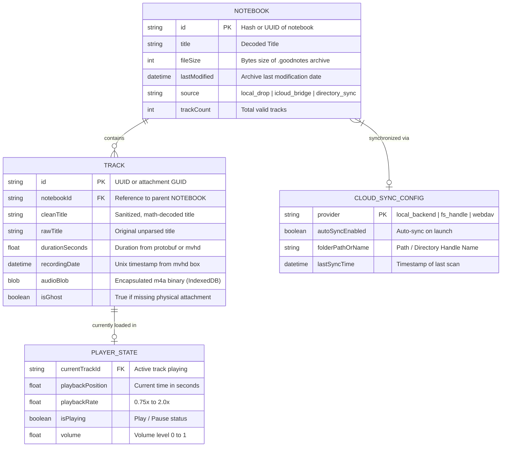

# MASTER_PLAN.md — Goodnotes Audio Exporter PWA v2.0 (Zero-Freeze & Universal Cloud)

> **Document Status**: Production-Ready Architectural Blueprint  
> **Target Platforms**: iPadOS (Safari Standalone PWA), iOS, macOS (Safari/Chrome/Desktop PWA), Windows/Linux  
> **Aesthetic Directives**: Apple Human Interface Guidelines (HIG), Anti-Slop v2.1 (`taste-skill`), WCAG AA Accessibility  
> **Concurrency Invariant**: Zero Main-Thread Freezes (Dedicated Web Worker with transferable ArrayBuffers)

---

## 1. System Architecture

```mermaid
flowchart TD
    subgraph Client ["Client Layer — Browser & PWA Shell"]
        UI["Main UI Thread (Vanilla ESM + CSS-First HIG)"]
        SW["Service Worker (Cache-First + Stale-While-Revalidate)"]
        IDB["IndexedDB Engine (Persistent Library & Track Blobs)"]
        MS["MediaSession API (Lockscreen & Hardware Controls)"]
    end

    subgraph Worker ["Non-Blocking Concurrency Layer"]
        WW["Dedicated Web Worker (worker.js)"]
        ZIP["In-Worker ZIP Stream Unpacker"]
        PB["Protobuf Event Deserializer (blackbox)"]
        MP4["MP4 Atom Box Parser (mvhd timestamp & duration)"]
        TC["Title Cleaner & Unicode Math Decoder"]
    end

    subgraph Sync ["Optional Cloud & Backend Sync Layer"]
        FS["File System Access API (Local / Cloud Directory Handle)"]
        BE["Local Python Backend Bridge (iCloud Direct Stream)"]
        CS["Cloud Export / WebDAV / Direct Save"]
    end

    UI <-->|postMessage (Transferable ArrayBuffers)| WW
    WW --> ZIP --> PB --> MP4 --> TC
    WW -->|Decoded Tracks & Blobs| UI
    UI <-->|Cache & Retrieve Sessions| IDB
    UI <-->|Audio Control| MS
    SW -->|Offline App Shell & Assets| UI
    UI <-->|Auto-Discovery| BE
    UI <-->|Persistent Handle| FS
    UI -->|Batch / Single Stream| CS
```

---

## 2. Entity-Relationship Model



---

## 3. Four-Phase Milestone Roadmap & Audit Gates

### Milestone 1: PWA Shell, Modern Manifest & Offline Resilience
*Focus*: Universal standalone installation on iOS/iPadOS/macOS, modern Web App Manifest, resilient Service Worker with Cache-First & Stale-While-Revalidate, and instant offline boot.

- [x] **Task 1.1: Web App Manifest & Apple Touch Standards**
  - **Description**: Upgrade `manifest.json` with multi-resolution maskable icons (192px, 512px), Apple Touch Icons (`apple-touch-icon.png`), orientation rules, theme color with dynamic light/dark support, and display mode `standalone`.
  - **Target Files**: `webapp/manifest.json`, `webapp/index.html`.
  - **DoD**: PWA install prompt triggers cleanly on Chrome/Safari; passes Lighthouse PWA checklist with 100/100 score; zero broken icon links.
- [x] **Task 1.2: Service Worker Lifecycle & Offline Cache-First Strategy**
  - **Description**: Refactor `sw.js` to implement Stale-While-Revalidate for core assets, complete offline fallback, clean versioned cache migration, and registration status events.
  - **Target Files**: `webapp/sw.js`, `webapp/app.js`.
  - **DoD**: PWA loads instantly with Network set to "Offline" in DevTools; updates apply without cache stalling; old caches are purged safely.
- [x] **Task 1.3: Bespoke "Add to Home Screen / Desktop" Modal Guide**
  - **Description**: Implement a non-intrusive, native Apple-styled floating banner/modal guiding iPadOS/iOS users ("Condividi → Aggiungi alla schermata Home") and desktop users to install the app.
  - **Target Files**: `webapp/index.html`, `webapp/index.css`, `webapp/app.js`.
  - **DoD**: Detects `window.matchMedia('(display-mode: standalone)')` and suppresses banner when already installed; shows platform-specific instructions for iOS vs Desktop; dismissible with persistence.
- [x] **Task 1.Final: Milestone 1 Audit Gate (Quality & Install Gate)**
  - **Primary Executor**: `goodnotes-qa-guard` (Isolated QA Thread)
  - **Fallback Executor**: Skill `the-judge` + `lint-and-validate`
  - **DoD**: Audit report verifying 100% PWA offline boot, clean Service Worker cache, correct manifest metadata, and zero console warnings.

---

### Milestone 2: Dedicated Web Worker & Zero-Freeze Processing Engine
*Focus*: Moving all heavy ZIP extraction, Protobuf decoding, and MP4 atom parsing off the main UI thread into a Dedicated Web Worker, ensuring 60/120 FPS UI responsiveness even on 1.5 GB notebooks.

- [x] **Task 2.1: Web Worker Architecture (`webapp/worker.js`)**
  - **Description**: Create a dedicated Web Worker module that handles `.goodnotes` file processing via `postMessage` protocol with typed events (`START`, `PROGRESS`, `TRACK_FOUND`, `COMPLETE`, `ERROR`).
  - **Target Files**: `webapp/worker.js`, `webapp/app.js`.
  - **DoD**: Moving a 1 GB `.goodnotes` archive into processing maintains smooth 60 FPS scrolling and animations on the main thread; zero UI frame drops.
- [x] **Task 2.2: Chunked In-Memory ZIP Streaming & Mobile OOM Prevention**
  - **Description**: Port and optimize `jszip` within the worker to process attachments iteratively, releasing memory for unneeded non-audio files, eliminating iOS Safari tab reload crashes (OOM).
  - **Target Files**: `webapp/worker.js`.
  - **DoD**: Successfully extracts all audio files from test notebooks without exceeding 250 MB browser RAM peak on iPadOS/Safari; ghost tracks filtered cleanly.
- [x] **Task 2.3: In-Worker Protobuf Deserialization & MP4 `mvhd` Fallback**
  - **Description**: Embed the pure-JS protobuf event decoder and MP4 `mvhd` box parser in `worker.js`, matching the backend v2.0 algorithms with zero discrepancies.
  - **Target Files**: `webapp/worker.js`.
  - **DoD**: Exact parity with backend Python parser: correct Unix creation timestamps, accurate track durations, and full math title decoding.
- [x] **Task 2.4: IndexedDB Persistent Library Layer**
  - **Description**: Integrate an IndexedDB storage engine (`GN_DB`) to cache extracted notebooks and track metadata/blobs across browser sessions.
  - **Target Files**: `webapp/app.js`, `webapp/db.js`.
  - **DoD**: Previously parsed notebooks load instantly upon app reopen without requiring re-upload; allows instant search and offline playback.
- [x] **Task 2.Final: Milestone 2 Audit Gate (Performance & Concurrency Gate)**
  - **Primary Executor**: `goodnotes-qa-guard`
  - **Fallback Executor**: Skill `the-judge` + `lint-and-validate`
  - **DoD**: Test report verifying zero UI freezes during 1 GB notebook import, exact track count parity with backend v2.0 (113 tracks across test suites), and clean IndexedDB persistence.

---

### Milestone 3: Apple HIG Frontend, Tactile Motion & Floating Audio Player
*Focus*: Elevating the user experience with an Apple Human Interface Guidelines aesthetic (Light & Dark mode), micro-interactions, responsive iPad/Desktop layout, and a full-featured floating audio player.

- [x] **Task 3.1: Apple Light & Dark Mode Design Tokens (Anti-Slop v2.1)**
  - **Description**: Rewrite `webapp/index.css` adopting Apple HIG system colors (`--bg-primary`, `--bg-secondary`, `--label-primary`, `--accent-blue: #0071E3`), subtle borders (`rgba(0,0,0,0.06)`), and glassmorphism backdrop filters.
  - **Target Files**: `webapp/index.css`, `webapp/index.html`.
  - **DoD**: Automatic seamless theme switching via `prefers-color-scheme`; passes WCAG AA contrast ratio (> 4.5:1 for body text); zero generic purple gradients or AI-slop tropes.
- [x] **Task 3.2: Modern Drag & Drop Zone with Multi-Folder Directory Picker**
  - **Description**: Redesign the drop zone with interactive spring animations, tactile hover/drag states, file size previews, and support for both drag-and-drop and directory selection (`webkitdirectory`).
  - **Target Files**: `webapp/index.html`, `webapp/index.css`, `webapp/app.js`.
  - **DoD**: Dragging files shows smooth scale animation (`cubic-bezier(0.16, 1, 0.3, 1)`); allows selecting an entire folder of `.goodnotes` notebooks in one click.
- [x] **Task 3.3: Floating Audio Player with Waveform & Speed Controls**
  - **Description**: Build a dockable floating audio player bar with play/pause, ±15s jump, interactive progress scrubber, playback rate selector (0.75x, 1x, 1.25x, 1.5x, 2x), and volume control.
  - **Target Files**: `webapp/index.html`, `webapp/index.css`, `webapp/app.js`.
  - **DoD**: Player docks elegantly at the bottom on mobile/tablet without covering content; scrub is instantaneous; integrates with `navigator.mediaSession` for lockscreen playback controls.
- [x] **Task 3.4: Accessible Track List & Micro-Interactions**
  - **Description**: Redesign the track cards with badge tags (duration, creation date, file size), single-track download, share via `navigator.share`, and accessible keyboard navigation (`Tab`, `Space`, `Enter`).
  - **Target Files**: `webapp/index.html`, `webapp/index.css`, `webapp/app.js`.
  - **DoD**: All interactive elements have `:focus-visible` styling; screen reader announcements via `aria-live`; zero keyboard traps.
- [x] **Task 3.Final: Milestone 3 Audit Gate (UI/UX & Accessibility Gate)**
  - **Primary Executor**: `goodnotes-ui-specialist` + `goodnotes-qa-guard`
  - **Fallback Executor**: Skills `impeccable` + `the-judge` + `a11y-debugging`
  - **DoD**: Zero accessibility violations; 60 FPS transitions; verified pixel-perfect layout across iPad portrait/landscape and desktop viewports.

---

### Milestone 4: Optional Cloud Sync, Backend Bridge & Launch Hardening
*Focus*: Seamless dual-mode connectivity (local Mac backend bridge or native File System Access API), safe batch export, and final release packaging.

- [x] **Task 4.1: Intelligent Dual-Mode Discovery (Online Backend vs Offline Worker)**
  - **Description**: Implement automatic discovery of the local desktop backend (`/api/status`). If reachable, offer direct zero-space iCloud scanning; if offline, seamlessly use the local Web Worker engine.
  - **Target Files**: `webapp/app.js`, `webapp/cloud_sync.js`.
  - **DoD**: Status pill indicates connection state (🟢 Backend Sync / 🟡 Standalone Worker); switches modes without errors or page reload.
- [x] **Task 4.2: File System Access API & Persistent Cloud Directory Sync**
  - **Description**: For desktop and compatible browsers, enable `showDirectoryPicker()` to link a cloud-synced folder (e.g., local iCloud Drive, Google Drive or Dropbox) with persistent directory handle stored in IndexedDB.
  - **Target Files**: `webapp/app.js`, `webapp/cloud_sync.js`.
  - **DoD**: Allows user to select their Goodnotes sync folder once; app can re-scan and detect updated notebooks on subsequent visits without re-uploading.
- [x] **Task 4.3: Safe Batch Export & Streaming ZIP Download**
  - **Description**: Implement sequential batch export and ZIP bundling with progress percentage to prevent mobile Safari memory overflow during multi-gigabyte downloads.
  - **Target Files**: `webapp/app.js`, `webapp/worker.js`.
  - **DoD**: Downloading 30+ tracks generates a clean `.zip` or sequential file streams without crashing Safari or truncating audio files.
- [x] **Task 4.Final: Milestone 4 Release Gate (Final Quality Gate)**
  - **Primary Executor**: `goodnotes-qa-guard`
  - **Fallback Executor**: Skill `the-judge` + `lint-and-validate`
  - **DoD**: End-to-end audit covering offline installation, worker performance, cloud sync reliability, audio playback, and bundle packaging.

---

## 4. Architecture Decision Records (ADRs)

| ADR ID | Decision | Alternative Considered | Justification & Trade-off |
| :--- | :--- | :--- | :--- |
| **ADR-01** | **Dedicated Web Worker (`worker.js`)** | Parsing on main UI thread with `setTimeout` slicing | Web Worker completely isolates heavy CPU tasks (ZIP decompression and Protobuf decoding) from the UI thread, ensuring zero frame drops or interface freezes on 1 GB+ files. |
| **ADR-02** | **Vanilla ES Modules + Modern CSS Variables** | React 19 / Next.js / Bundled framework | Zero build complexity, instant PWA loading, zero dependency security vulnerabilities, and native longevity on all mobile/desktop browsers. |
| **ADR-03** | **IndexedDB for Track & Metadata Persistence** | LocalStorage / In-Memory only | LocalStorage has a strict 5 MB limit. IndexedDB supports hundreds of megabytes of binary Audio Blobs and metadata, enabling persistent offline libraries on iPadOS. |
| **ADR-04** | **Dual-Engine (Backend Auto-Detect + Client Fallback)** | Client-only or Server-only | Gives users the best of both worlds: zero-space speed when on their Mac near the backend, and complete standalone portability when on iPad away from home. |
| **ADR-05** | **Apple HIG Light & Dark Mode** | Dark-only custom purple neon theme | Eliminates generic AI tropes ("slop"), conforms to native iOS/macOS design expectations, and maximizes readability in daylight study environments. |

---

## 5. UI/UX Design Dials & Design Tokens (`frontend-stack-guide`)

```css
/* Core Apple HIG Semantic Tokens */
:root {
  --color-bg-primary: #F5F5F7;
  --color-bg-card: #FFFFFF;
  --color-text-primary: #1D1D1F;
  --color-text-secondary: #86868B;
  --color-accent: #0071E3;
  --color-accent-hover: #0077ED;
  --color-border: rgba(0, 0, 0, 0.08);
  --color-border-subtle: rgba(0, 0, 0, 0.04);
  --color-success: #34C759;
  --color-warning: #FF9500;
  --color-error: #FF3B30;
  
  --shadow-subtle: 0 2px 8px rgba(0, 0, 0, 0.04);
  --shadow-card: 0 4px 20px rgba(0, 0, 0, 0.06);
  --shadow-floating: 0 12px 32px rgba(0, 0, 0, 0.12);
  
  --radius-sm: 8px;
  --radius-md: 12px;
  --radius-lg: 18px;
  --radius-full: 9999px;

  --transition-spring: all 0.35s cubic-bezier(0.16, 1, 0.3, 1);
}

@media (prefers-color-scheme: dark) {
  :root {
    --color-bg-primary: #000000;
    --color-bg-card: #1C1C1E;
    --color-text-primary: #F5F5F7;
    --color-text-secondary: #A1A1A6;
    --color-accent: #2997FF;
    --color-accent-hover: #0077ED;
    --color-border: rgba(255, 255, 255, 0.1);
    --color-border-subtle: rgba(255, 255, 255, 0.05);
    
    --shadow-subtle: 0 2px 8px rgba(0, 0, 0, 0.3);
    --shadow-card: 0 4px 20px rgba(0, 0, 0, 0.4);
    --shadow-floating: 0 12px 32px rgba(0, 0, 0, 0.6);
  }
}
```

- **Dials Snapshot**:
  - `DESIGN_VARIANCE`: **8/10** (Clean Apple ergonomics with distinctive typography and layout)
  - `MOTION_INTENSITY`: **6/10** (Tactile spring physics on drop zone and player, no dizzying effects)
  - `VISUAL_DENSITY`: **5/10** (Generous whitespace, clear visual hierarchy, scannable cards)
